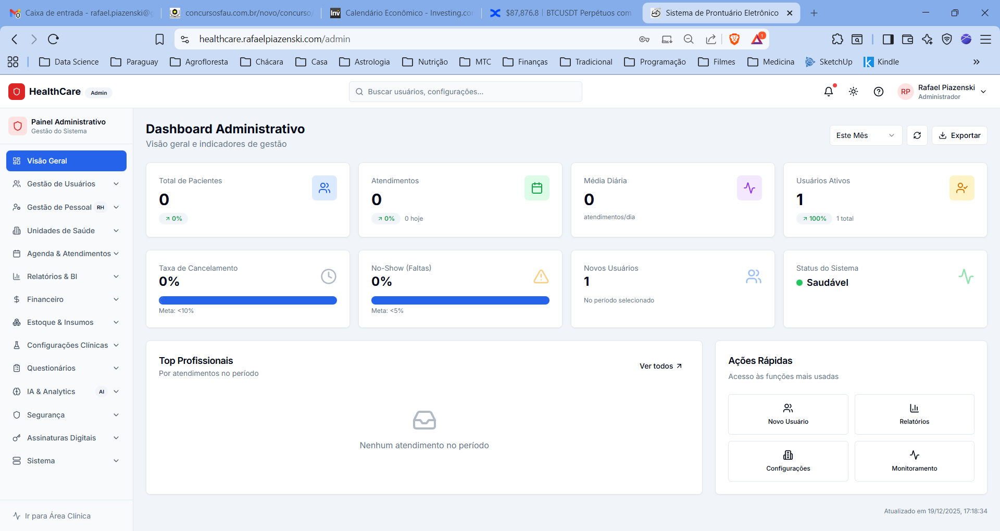
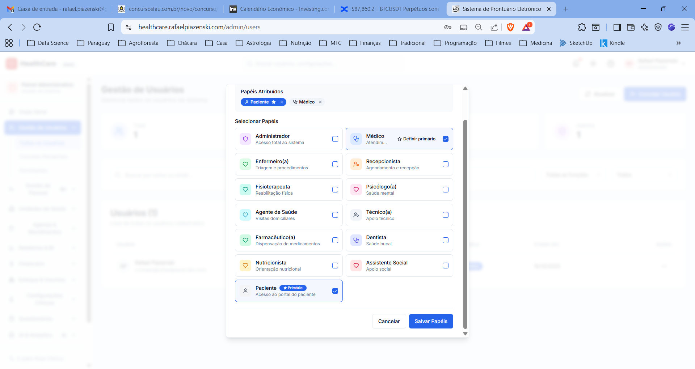
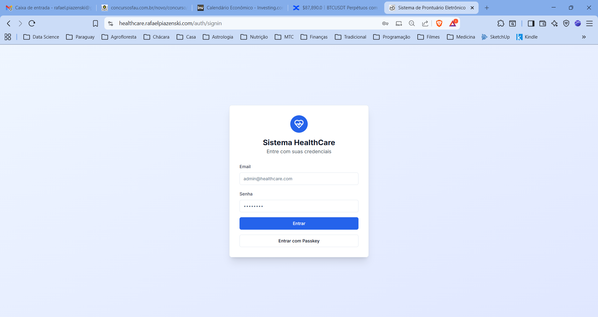
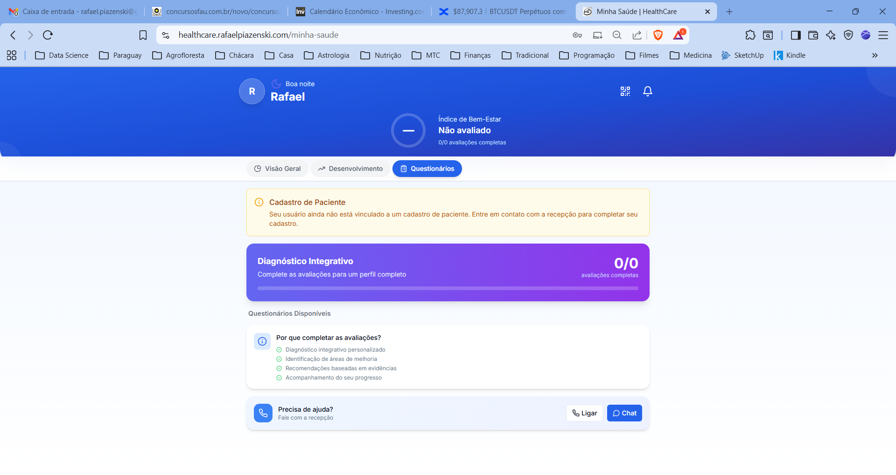

# HealthCare EHR: AI-Powered Clinical Management System

> **A Full-Stack Electronic Health Record (EHR) system designed by a Senior Physician to solve real-world clinical workflow inefficiencies.**

  

## 🏥 The Problem
As a doctor with 20 years of experience (Emergency & Family Medicine), I found most market EHRs to be:
- **Cluttered:** Too many clicks to perform simple tasks.
- **Disconnected:** Poor integration with clinical reasoning.
- **Slow:** Legacy architectures that hamper high-volume shifts.

## 💡 The Solution
I built **HealthCare** from scratch to be the tool I always wanted. It focuses on **UX/UI for clinicians** and utilizes **GenAI** to automate documentation.

### Key Features
- **User-Centric UX:** Workflow designed to mirror the actual medical anamnesis process.
- **AI Integration:** Uses LLMs to summarize patient history and suggest ICD-10 codings based on free-text input.
- **Self-Hosted Sovereignty:** Deployed on **UmbrelOS** (Linux) using Docker, ensuring 100% data privacy and ownership.
- **Fast & Responsive:** Modern React frontend with a robust Node.js backend.

## 🛠️ Tech Stack

| Component | Technology | Description |
| :--- | :--- | :--- |
| **Frontend** | React.js | Dynamic interfaces, component-based architecture. |
| **Backend** | Node.js (Express) | API RESTful services. |
| **Database** | PostgreSQL | Relational data integrity for medical records. |
| **DevOps** | Docker & Docker Compose | Containerization for consistent environments. |
| **Infra** | UmbrelOS / Linux | Running on a dedicated MiniPC server. |

## 📸 Interface Preview

### Administrative & Clinical Management
> The command center for hospital administration, featuring Role-Based Access Control (RBAC) and real-time metrics.

| Executive Dashboard | Role-Based Access Control (RBAC) |
| :---: | :---: |
|  |  |
| **Real-time KPIs & Occupancy Rates** | **Granular Permissions (Doctors, Nurses, Multidisciplinary Team)** |

### Patient Portal (Mobile First)
> A dedicated interface for patients to track their wellness index, view prescriptions, and schedule appointments.

| Secure Login | Patient Wellness Hub |
| :---: | :---: |
|  |  |
| **Secure Authentication with JWT** | **Holistic Health Overview & Wellness Index** |

## 🚀 How to Run (Local Dev)

```bash
# Clone the repository
git clone https://github.com/rpzk/HealthCare.git

# Enter directory
cd HealthCare

# Start with Docker Compose
docker-compose up -d
