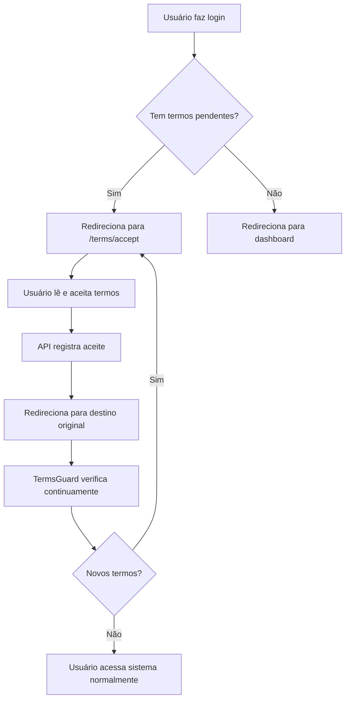

# Sistema de Termos de Consentimento Obrigatórios

## Resumo

O sistema agora **força** os usuários a aceitarem os termos de consentimento obrigatórios antes de acessar qualquer funcionalidade do sistema após o login.

## Como Funciona

### 1. Verificação no Login (Server-Side)

**Arquivo**: [app/page.tsx](app/page.tsx)

Quando o usuário faz login, a página principal verifica se existem termos pendentes **antes** de redirecionar para o dashboard apropriado:

```typescript
// Verificar termos pendentes antes de redirecionar
const pendingTermIds = await checkPendingTerms(prisma, session.user.id, effectiveRole)
if (pendingTermIds && pendingTermIds.length > 0) {
  redirect(`/terms/accept?returnTo=${encodeURIComponent(returnTo)}`)
}
```

### 2. Verificação Contínua (Client-Side)

**Arquivos**: 
- [hooks/use-terms-enforcement.ts](hooks/use-terms-enforcement.ts)
- [components/terms-guard.tsx](components/terms-guard.tsx)

O hook `useTermsEnforcement` verifica continuamente se há termos pendentes e redireciona o usuário para a página de aceite se necessário. Este hook é usado através do componente `TermsGuard` nos layouts principais:

- [app/admin/layout.tsx](app/admin/layout.tsx) - Área administrativa
- [app/minha-saude/layout.tsx](app/minha-saude/layout.tsx) - Área do paciente

### 3. Página de Aceite de Termos

**Arquivo**: [app/terms/accept/page.tsx](app/terms/accept/page.tsx)

Interface onde o usuário visualiza e aceita os termos pendentes. Características:

- Mostra todos os termos que precisam ser aceitos
- Exibe conteúdo completo de cada termo em Markdown
- Checkbox individual para cada termo
- Botão "Aceitar e continuar" só habilitado quando todos forem marcados
- Após aceite, redireciona para a página de origem (`returnTo`)

### 4. APIs de Suporte

**Arquivos**:
- [app/api/terms/pending/route.ts](app/api/terms/pending/route.ts) - Lista termos pendentes do usuário
- [app/api/terms/accept/route.ts](app/api/terms/accept/route.ts) - Registra aceite dos termos
- [lib/check-pending-terms.ts](lib/check-pending-terms.ts) - Função utilitária para verificar termos pendentes

## Fluxo Completo



## Gerenciamento de Termos (Admin)

**Arquivo**: [app/admin/terms/page.tsx](app/admin/terms/page.tsx)

Administradores podem:
- Criar novos termos com slug, título, versão e conteúdo
- Definir audiência (ALL, PATIENT, PROFESSIONAL)
- Ativar/desativar termos
- Visualizar histórico de versões

## Base de Dados

**Schema**: [prisma/schema.prisma](prisma/schema.prisma)

### Modelo `Term`
```prisma
model Term {
  id       String   @id @default(cuid())
  slug     String   // Identificador único (ex: "ai-consent-patient")
  title    String   // Título exibido
  content  String   @db.Text // Conteúdo em Markdown
  version  String   // Versão do termo
  isActive Boolean  @default(true)
  audience TermAudience @default(ALL) // ALL, PATIENT, PROFESSIONAL
  // ...
}
```

### Modelo `TermAcceptance`
```prisma
model TermAcceptance {
  id     String @id @default(cuid())
  userId String
  termId String
  // Snapshot auditável (mantém histórico)
  termSlug    String?
  termTitle   String?
  termVersion String?
  termContent String? @db.Text
  acceptedAt  DateTime @default(now())
  ipAddress   String?
  userAgent   String?
  // ...
}
```

## Enforcement Granular por Funcionalidade

**Arquivo**: [lib/terms-enforcement.ts](lib/terms-enforcement.ts)

Alguns endpoints críticos verificam termos específicos através da função `assertUserAcceptedTerms`:

```typescript
await assertUserAcceptedTerms({
  prisma,
  userId: session.user.id,
  audience: getAudienceForRole(session.user.role),
  gates: ['AI', 'RECORDING'] // Portas específicas
})
```

### Gates Disponíveis
- `AI` - Consentimento para uso de IA
- `TELEMEDICINE` - Consentimento para telemedicina
- `RECORDING` - Consentimento para gravação
- `IMAGE` - Consentimento para uso de imagens
- `ADMIN_PRIVILEGED` - Operações administrativas sensíveis

## Como Criar um Novo Termo

1. Acesse `/admin/terms`
2. Clique em "Criar novo termo"
3. Preencha:
   - **Slug**: identificador único (ex: `privacy-policy-2025`)
   - **Título**: nome exibido (ex: "Política de Privacidade")
   - **Versão**: versão do termo (ex: "1.0.0")
   - **Conteúdo**: texto em Markdown
   - **Audiência**: ALL, PATIENT ou PROFESSIONAL
4. Salve e ative o termo

> **Importante**: Quando um termo é criado/ativado, todos os usuários da audiência correspondente precisarão aceitá-lo no próximo login.

## Rotas Excluídas da Verificação

O hook `useTermsEnforcement` **não** verifica termos nas seguintes rotas:

- `/auth/*` - Autenticação
- `/terms/*` - Própria página de termos
- `/api/*` - APIs
- `/privacy` - Política de privacidade
- `/help` - Ajuda
- `/register/*` - Registro
- `/invite/*` - Convites

Isso evita loops infinitos e permite que usuários acessem informações necessárias.

## Testes

### Teste Manual

1. Criar um novo termo ativo em `/admin/terms`
2. Fazer logout e login novamente
3. Deve ser redirecionado para `/terms/accept`
4. Aceitar o termo
5. Deve ser redirecionado para o dashboard apropriado

### Verificar Termos Pendentes via API

```bash
curl -X GET 'http://localhost:3000/api/terms/pending' \
  -H 'Cookie: next-auth.session-token=SEU_TOKEN'
```

### Aceitar Termos via API

```bash
curl -X POST 'http://localhost:3000/api/terms/accept' \
  -H 'Content-Type: application/json' \
  -H 'Cookie: next-auth.session-token=SEU_TOKEN' \
  -d '{"termIds": ["term_id_1", "term_id_2"]}'
```

## Auditoria

Todos os aceites são registrados com:
- Timestamp (`acceptedAt`)
- IP do usuário (`ipAddress`)
- User-Agent (`userAgent`)
- Snapshot completo do termo aceito (slug, título, versão, conteúdo)

Isso garante rastreabilidade completa para fins legais e de compliance.

## Troubleshooting

### Usuário preso em loop de redirecionamento

**Causa**: Erro na verificação de termos ou termos inativos.

**Solução**:
1. Verificar logs do servidor
2. Verificar se há termos ativos em `/admin/terms`
3. Verificar se há erro no banco (conexão, migrations)

### Termos não aparecem para aceite

**Causa**: Audiência incorreta configurada no termo.

**Solução**:
1. Verificar campo `audience` do termo
2. Pacientes só veem termos com `audience: PATIENT` ou `ALL`
3. Profissionais veem termos com `audience: PROFESSIONAL` ou `ALL`

### Termo já aceito mas ainda aparece

**Causa**: Cache ou sessão desatualizada.

**Solução**:
1. Fazer logout e login novamente
2. Limpar cache do navegador
3. Verificar no banco se o aceite foi registrado em `term_acceptances`

## Referências

- [Copilot Instructions](.github/copilot-instructions.md) - Instruções gerais do projeto
- [Prisma Schema](prisma/schema.prisma) - Modelos de dados
- [Terms Enforcement](lib/terms-enforcement.ts) - Lógica de enforcement
- [Quick Reference](docs/QUICK_REFERENCE.md) - Referência rápida do projeto
